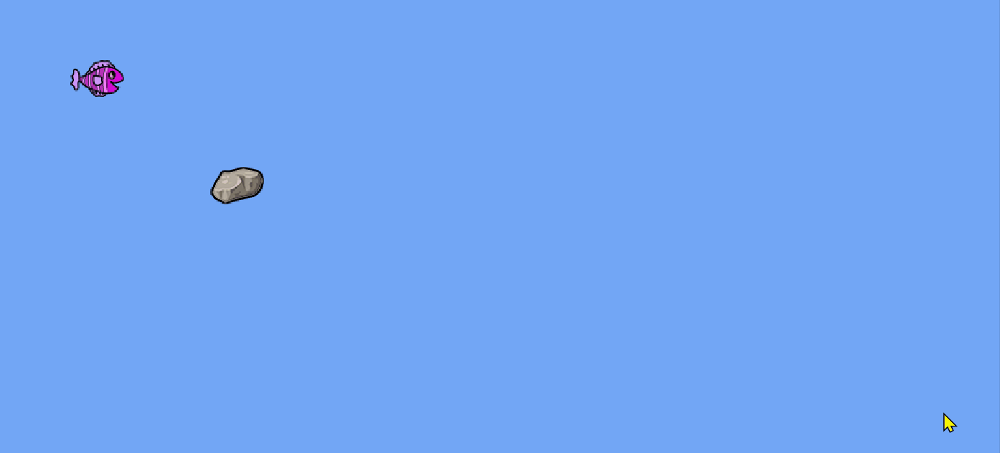

# Kámen a rybka
Upravte program tak, aby rybka po spuštění aplikace obeplavala kámen kolem dokola (nebo spíš do čtverce). Třeba takhle:

Podívejte se, jaké metody jsou dostupné na třídě `Rybka`.
Zjistíte, že voláním metody rybka urazí malou vzdálenost, bude se tedy hodit použít cyklus, aby rybka stejným směrem plavala několikrát za sebou. 
